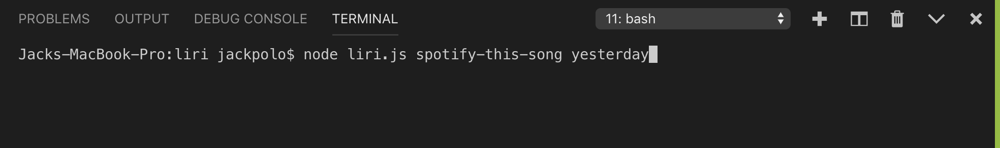
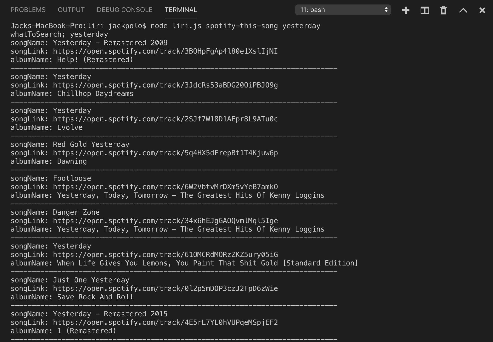
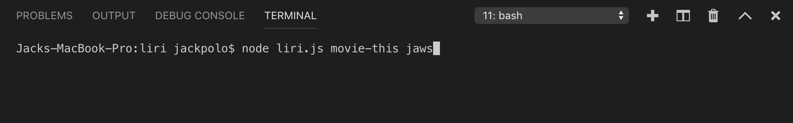
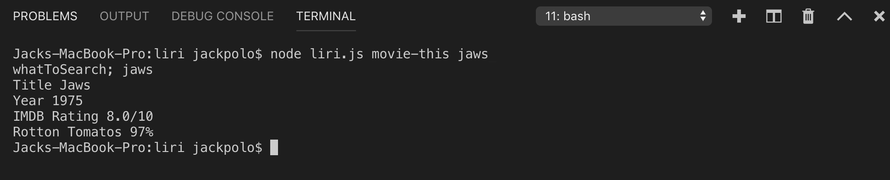
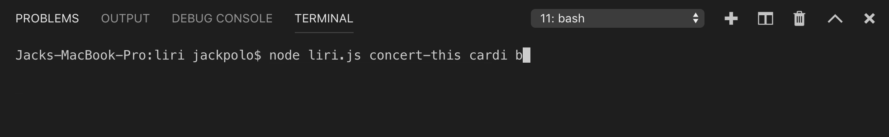

# liri
This application is similar to SIri only difference is that it runs in the terminal as opposed to speaking to it in order to get results.

The following are the commands that you can give it:

To execute a song search using spotify this is the command:

Once you execute, your result will look something like this:

To execute a movie search along with specific details regarding the movie with OMDB this is the command:

Once you execute, your result will look something like this:

To execute a concert search and all its details using Bands In Town, this is the command: 

Once you execute, your result will look something like this:

